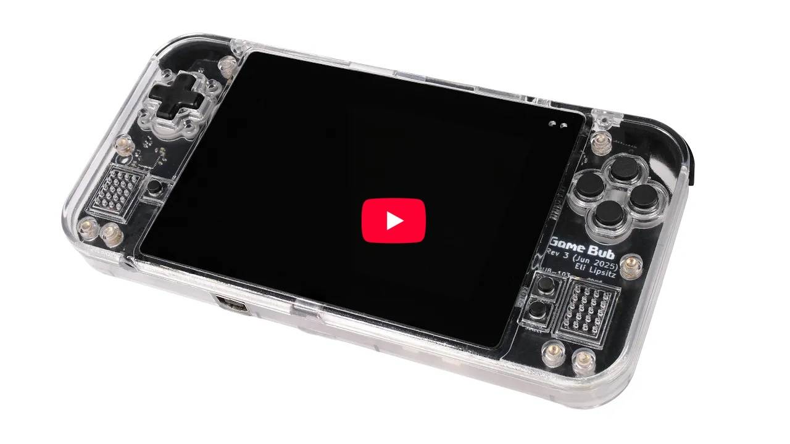

**Game Bub** is an open-source FPGA retro emulation handheld, with support for Game Boy, Game Boy Color, and Game Boy Advance games.

Check out the [announcement blog post](https://eli.lipsitz.net/posts/introducing-gamebub/) for an in-depth look at the development process!

You can buy your own, prebuilt Game Bub from **[Crowd Supply](https://www.crowdsupply.com/second-bedroom/game-bub)**!

Want to chat about Game Bub? Feel free to [join the Discord](https://discord.gg/T5xrYpMfN7). 

## Features
* Play physical Game Boy / Color / Advance cartridges
* Load and play ROM files from a microSD card (with built-in support for rumble, clock, accelerometer, gyroscope)
* Multiplayer link cable functionality
* Custom, from-scratch Game Boy and Game Boy Advance FPGA cores with great game compatibility
* 14+ hour battery life 
* Video output to TV or monitor via custom dock
* Extensible hardware, designed for future improvements

## Building

Building a Game Bub handheld requires manufacturing PCBs, 3D printing the shell and buttons, and assembling components from a variety of sources. For information on manufacturing and assembling your own, see [docs/building.md](docs/building.md).

For other inquiries, contact me directly at eli@lipsitz.net.

## Architecture

For an in-depth description of the project architecture, see [docs/architecture.md](docs/architecture.md).

The Game Bub handheld consists of a Xilinx XC7A100T FPGA to do the main emulation and I/O, and an ESP32-S3 microcontroller to do auxiliary tasks (configuring the FPGA, rendering the UI, loading ROM files from a microSD card and sending it to the FPGA).

### Directory Structure

* `pcb`: PCB design files for Handheld, Dock, and others
* `3d`: STLs for 3D printed shell and buttons
* `fpga`: FPGA source code (HDL), written in [Chisel](https://github.com/chipsalliance/chisel)
* `firmware/handheld`: Microcontroller firmware

## License

Unless otherwise specified:
* FPGA source code (in `fpga/`) and firmware (in `firmware/`) is licensed under GPLv3 (`GPL-3.0-only`).
* 3D STL files (in `3d/`) is licensed under Creative Commons Attribution / Share-Alike 4.0 (`CC-BY-SA-4.0`)
* PCB schematic and layout files (in `pcb/`) are licensed under Creative Commons Attribution / Share-Alike 4.0 (`CC-BY-SA-4.0`)

At a high level, this means that you can copy, share, and modify the source code, as long as you provide proper attribution and share your source code / design files with the same license. However, this does not mean that you can use the "Game Bub" name and logo for your product without permission.
