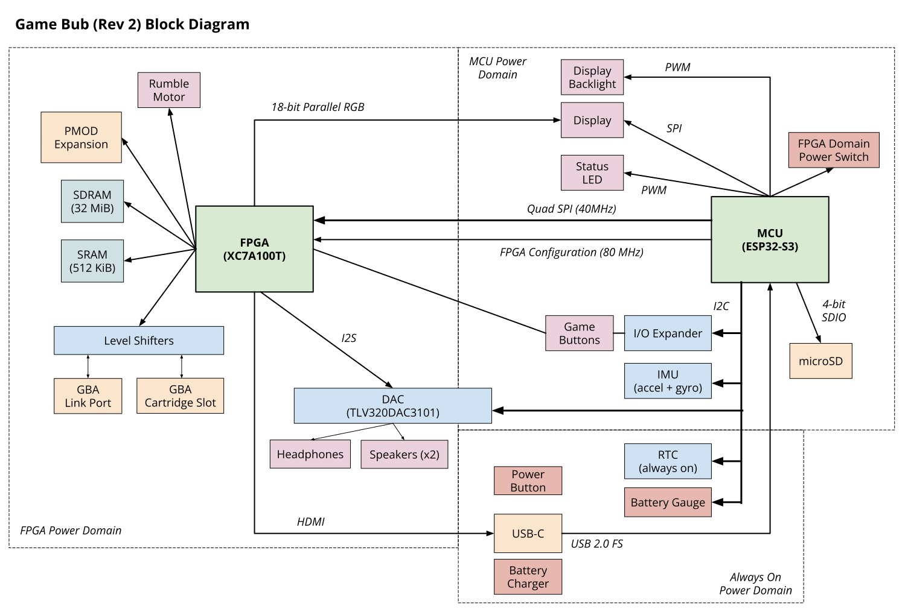

# Architecture

The physical architecture of the Game Bub handheld is summarized in the following block diagram.

See the [schematic](../pcb/handheld_rev2/handheld.pdf) for more information.

     

## Power 

The device is split into three power domains:

* **Always on**: real-time clock, battery charger, battery gauge, and the power switch circuit.
    * `VBATT` (directly from the battery, 3.7V to 4.2V)
    * `VSYS_ALWAYS` (from the BQ24073 charger)
* **MCU**: Powers the MCU, its peripherals, and the display. Pressing the power switch powers on this power domain.
    * `VSYS` (~3.7V to 5.0V), from `VSYS_ALWAYS` through a load switch
    * `+3V3` (3.3V), generated by a TLV62585 buck converter from `VSYS`
* **FPGA**: Controlled by the `FPGA_ENABLE` signal from the MCU. Powers the FPGA and its peripherals. Also powers the DAC digital and analog core voltages (but the IO rails are powered as part of the MCU power domain).
    * `+1V0` (1.0V), generated by a TLV62585 buck converter from `VSYS`
    * `+5V0` (5.0V), generated by a TPS61022 boost converter from `VSYS`
    * `+1V8` (1.8V), generated by a TPS61022 boost converter from `VSYS`
    * `+3V3_FPGA` (3.3V), gated by a load switch from `+3V3`
    * `VGB` (3.3V or 5.0V), muxed from `+3V3_FPGA` or `+5V0` depending on whether there is a Game Boy (5V) or Game Boy Advance (3.3V) cartridge present. This muxing is controlled by the FPGA, and this is used to power the cartridge, link port, and the level shifters.

The FPGA requires careful power sequencing: `FPGA_ENABLE` enables `+1V0` and `+5V0`. `+1V8` is enabled once `+1V0` stabilizes, and `+3V3_FPGA` is enabled once that stabilizes.

## MCU and FPGA Responsibilities

The MCU is responsible for system control: it boots the device and manages the FPGA (power and configuration). It also renders the UI (sending completed frames over the FPGA for display).

The FPGA does all game emulation. It has direct access to the cartridge slot and link ports, and has dedicated memory (32 MiB of SDRAM, 512 KiB of SRAM) to assist with this. It produces audio and sends it to the DAC via I2S, and it has a high-bandwidth 18-bit parallel interface to the display. 

The FPGA also has 4 high-speed differential pairs routed out to the USB-C connector. This is used, with the custom dock in a vendor-specific alt mode, to output HDMI audio and video (directly from the FPGA). 

The high-speed QSPI link between the MCU and the FPGA (4 bit at 40 MHz, 20 MB/sec) is primarily used for control signals (telling the FPGA to play or pause), as well as rendering the UI. The FPGA drives the display, so the MCU has to send its UI through the FPGA.

Additionally, when using an emulated cartridge, the MCU sends the ROM file over to the FPGA to be stored in SDRAM, and periodically sends IMU updates (to emulate cartridges with accelerometers or gyroscopes).

Upon boot, the MCU loads the FPGA bitstream from the microSD card (4-bit SDIO), powers on the FPGA and configures it (using single SPI at 80 MHz). It initializes the display and other peripherals, and renders the initial UI.

## FPGA Structure

The top-level FPGA design is written in SystemVerilog and provides glue code to interface with the outside world, and instantiates the MMCM/PLLs, the HDMI module, and the main `HandheldTop` module, written in Chisel.

The `HandheldTop` module provides functionality common to both the Game Boy and GBA emulators. It instantiates the SPI receiver, MCU interrupt sender, SDRAM and SRAM controller, common configuration registers, the audio output (I2S), and the video output (DPI).

It instantiates the main emulator as a submodule ("inner module"), sending button input, receiving audio and video data (pixel by pixel, sample by sample, as it's generated), and arbitrating RAM access between the inner module and the MCU.

Video data from the inner module is placed into a triple-buffered framebuffer (backed by block RAM). The triple buffering is unfortunately essential because the display is rotated 90 degrees, so there would be diagonal tearing if entire frames were not buffered in memory. This also helps for HDMI output, which has to run at a constant 60 Hz frame rate, compared to the 59.73 Hz that the Game Boy and GBA run at. The UI from the MCU is received as 15-bit RGB (plus one alpha bit) and stored in a single buffer. The two are composited together as video is output.

### Clock Domains

* The "system" clock, which runs at the speed of the inner emulator (~8.39 MHz for Game Boy, ~16.78 MHz for GBA). Most of the logic runs in this clock domain
* The "av" (audio/video) clock, where the audio and video output is generated. This is 12.288 MHz when using the internal display, and 27.027 MHz when HDMI is enabled. HDMI uses a clock 5x faster as well for DDR TMDS encoding.
* The "sdram" clock, which runs at an integer multiple (e.g. 4x) of the "system" clock. This is used to communicate with the SDRAM module, and the integer multiple greatly simplifies clock domain crossing.
* The "spi" clock, which runs at 200 MHz. The SPI deserializer runs in this clock domain, allowing the 40 MHz SPI bus to be 5x oversampled. Read and write commands are deserialized and passed to the system clock domain via an asynchronous FIFO.

## MCU Structure

The MCU firmware is written with Rust, built on top of ESP-IDF with the [esp-idf-hal](https://github.com/esp-rs/esp-idf-hal) crate.

The UI is built with [Slint](https://github.com/slint-ui/slint). There's a single top-level Window, that holds the status bar and a swappable set of "Screen" components. Screens are each user-visible screen, such as the Main Menu, Rom Select, Settings, Tools, and Game screens.

Interrupts (from the FPGA, peripherals, or the button I/O expander) are handled in a dedicated interrupt thread, which sends events to a background "worker" thread. The UI runs on a dedicated "UI" thread, and the worker and UI threads communicate with each other through message passing.

When a game is being played, the Game screen is active. There are separate drivers for each type of bitstream (Game Boy or GBA), which handle loading the bootrom, loading and configuring the emulated cartridge, save files, and sending auxiliary data (e.g. IMU samples).
